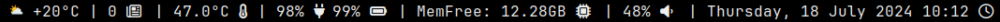

# modbar
Modbar is a modular status bar for dwm.

## Features
Each module is updated independently of the others based on a given time interval or by passing module name to a named pipe.

## Configuration
The program is configured via the config.h file. Modules are added to the modbar by editing the `modules` array.
- `COMMAND`: is a command modbar should run in order to get the output.
- `INTERVAL`: defines how often a module should be refreshed (in seconds). `0` means no refresh.

The `PIPE_PATH` directive tells the program where to create a named pipe that will be used to communicate with external programs. Modbar listens to the pipe in order to update a module on demand.

To update a module outside the schedule simply pass the command name into the pipe, eg.: `echo "volume" > /tmp/modbar.pipe`

## Modules
Modules used in the preview are available for download here: https://dobrowolski.dev/download/modules.tar.gz

Each module must reside inside the system PATH, or an absolute path has to be used.

## Installation
Run `sudo make install` to install modbar.
